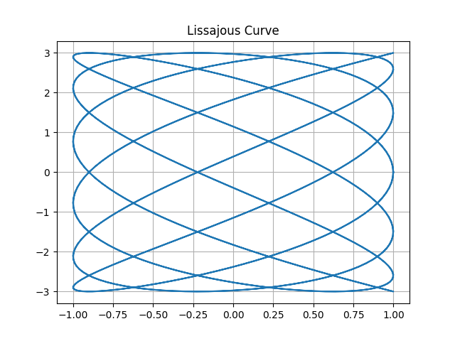

# Lissajous Curves
Lissajous Curves are determined by 2 parametric equations that require 4 parameters.   
> $\text{x} = \text{A} \sin(\text{at} + \frac{\pi}{2})$  
> $\text{y} = \text{B} \sin(\text{bt} )$

# Sample Output
  

# Arguments - Functionality - Return
1. The function requires the following arguments to be passed to it:
> The Amplitude of the X Parametric Equation = A  
> The Amplitude of the Y Parametric Equation = B  
> The Frequency of the X Parametric Equation = a  
> The Frequency of the Y Parametric Equation = b  
2. The function will calculate the values of X and Y over an interval (t) [-pi,pi] at 500 hundred of evenly spaced points
3. The function returns a list of two numpy arrays representing the values of X and Y.
> return-list's first element (index 0) = a numpy array of the calculated x values  
> return-list's second element (index 1) = a numpy array of the calculated y values

# Programming Concepts Used
1. Functions - Arguments (default arguments) - Return
2. NumPy and universal trignometric functions
3. inputs
> Rrompt Recycling  
> Exception Handling
4. loops
> Counter Controlled  
> Sentinel Control

# Libraries Used
1. NumPy
> np.linespace()  
> np.sin()  

2. MatPlotLib
> plt.plot()  
> plt.title()  
> plt.grid()  
>plt.show()  